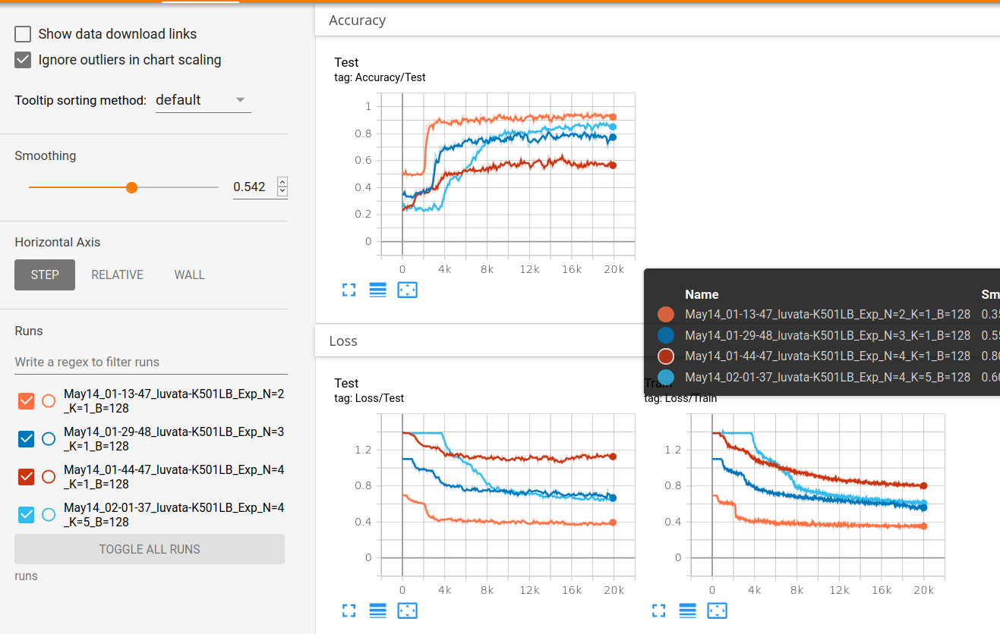

# HW1: Meta learning with MANN

[Original](http://cs330.stanford.edu/material/hw1_updated.zip) with omniglot dataset

## TODO
- [x] Problem 1: Data Processing for Few-Shot Classification
- [x] Problem 2: Memory Augmented Neural Networks [2, 3]
    - [x] Implement in Pytorch
    - [x] Fixed pytorch training error
    - [x] Added support cuda and tensorboard for pytorch
    - [ ] Fix TF implementation error
- [ ] Problem 3: Analysis
- [ ] Problem 4: Experimentation

~~- By using CNN as feature extractor and adding dropout, I got accuracy ~ 0.7 on 1 shot 5 ways~~ Turn out this 
overwhelming result comes from my bug that I accidentally zero-ing all meta-test labels of `input_labels` in `predict`, then calculate loss 
on it :scream: 

## Changelog
- [Update 05/14]: Added cuda training and tensorboard for pytorch
- [Update 05/13]: Fixed abnormal training result with shuffle separate strategy :beetle: 
- [Update 04/11]: Revert `load_data` to previous shuffle strategy ~~since new shuffle somehow won't work~~ It **worked**
- [Update 04/02]: Change `load_data` to shuffle separately the train and test set
- [Update 03/20]: Added `hw1_pytorch_cnn` with CNN encoder, ~~I got accuracy ~ 0.7 on 1 shot 5 ways, but turn out the 
training is pretty unstable, my suggest is to use small batch size with more training steps~~ My implementation was wrong

